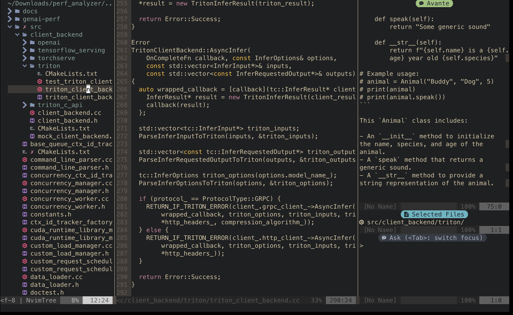

## manage dotfiles
I cuurent manage my dotfiles by [chezmoi](https://www.chezmoi.io/quick-start/) util.

## universal dependences

Efficient development of modern terminal tools with simple and convenient configuration.

+ fish

ubuntu linux install example:

```bash
apt install fish
```

+ ripgrep

+ fd

install fd

```fish
apt install fd-find
mkdir -p ~/.local/bin/
ln -s (which fdfind) ~/.local/bin/fd
fish_add_path ~/.local/bin/
```

+ fzf
+ chezmoi

use example
```fish
chezmoi cd
chezmoi add -v
chezmoi diff
```

install by fish:

```bash
curl -fsLS get.chezmoi.io | sh -c 'sh -s -- init --apply git@github.com:'$GITHUB_USERNAME'/dotfiles.git'
```

这种方式安装会直接应用dotfiles仓库中的配置。可以手动删除不需要的配置文件，比如：
```fish
rm ~/.vim
rm ~/.config/nvim
```

+ atuin

fish config, edit ~/.config/fish/config.fish

```
if status is-interactive
    # Commands to run in interactive sessions can go here
    atuin init fish | source
end
```

+ rustup
+ tmux

## nvim config interface

The simplest configuration for single file init.lua, supporting interaction between LSP and AI prompt.



### install 

[](./dot_config/nvim/readme.md)

## vim config dependences

+ vim 9.0+
+ ctags (Universal-ctags)
+ global (gtags-escope)
+ vim-Plug

## lazyvim config dependences

+ kitty
+ lazygit
+ nvim 9.4+ (config with lazyvim)
+ npm

